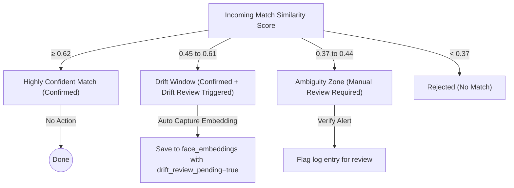

# Biometric Drift Reviews System Design

This document explains the concept, architecture, threshold mechanics, and administrative workflow of the **Biometric Drift Reviews** system implemented in the Hypersphere Biometric Engine.

---

## 1. What is Biometric Drift?
Over time, a user's facial appearance can gradually change due to aging, changes in facial hair, eyewear, hairstyles, weight shifts, or varying environmental factors (such as lighting conditions or camera sensors). 

If a biometric system only compares incoming scans against a single, static snapshot taken during enrollment:
*   The similarity score will slowly decrease over time.
*   Eventually, the score will drop below the verification threshold, leading to **False Rejections** (active users denied access).

**Biometric Drift Management** solves this by continuously monitoring verification similarity scores and automatically capturing new candidate embeddings when a user's appearance begins to drift, allowing the system to update and adapt the user's profile.

---

## 2. Threshold Mechanics
The system utilizes a dual-threshold system to automate drift detection without compromising security:



### The Drift Window (0.45 - 0.62)
1.  **Effective Match Threshold (0.45)**: The baseline similarity at which the system is confident the user is indeed who they claim to be. Any score above 0.45 marks attendance as `CONFIRMED`.
2.  **Drift Threshold (0.62)**: The similarity score above which a match is considered "highly confident and stable".
3.  **The Trigger**: When a verification scan succeeds (marked `CONFIRMED`) but its similarity score falls within the **[0.45, 0.62)** window, it indicates the face matched the user profile but is starting to drift.

---

## 3. Database & Matching Architecture
To allow profiles to adapt, the Hypersphere Engine supports **Multi-Embedding Enrollment**:

*   **`face_embeddings` Table**: Rather than storing a single vector in the `faculty` table, the system stores multiple historic embeddings (up to 15 vectors) per user in the `face_embeddings` table.
*   **pgvector HNSW Search**: When verifying a face, the backend queries the database using a cosine distance search across all active embeddings (`drift_review_pending = false`). If the closest vector in the database belongs to a faculty member and passes the threshold, they are verified.
*   **Capacity Cap**: To prevent storage bloat and ensure fast searches, a maximum of 15 embeddings are kept per user. When inserting a 16th embedding, the oldest vector (based on insertion order) is automatically pruned.

---

## 4. The Administrative Review Workflow

To prevent spoofing or bad enrollment attempts (e.g. another person matching a user at a borderline threshold) from polluting a user's profile, **all drift updates are gated by administrator approval**:

```
[Verification Step]
        │
        ▼ (Similarity falls in 0.45 - 0.62 range)
[Create Pending Drift Request]
        │
        ▼ (Saved in face_embeddings with drift_review_pending = true)
[Admin Dashboard Portal] ───► Admin reviews details
        │
        ├─► [Approve] ───► Set drift_review_pending = false (Vector is now active in matching pool)
        │
        └─► [Reject]  ───► Delete embedding from face_embeddings table
```

### Action Scenarios:
*   **Approve & Save Embedding**: The administrator verifies the match looks correct. The `drift_review_pending` flag is set to `false`. The new vector immediately joins the user's active verification pool, improving future matching similarity.
*   **Reject & Discard**: The administrator suspects a false match or poor image quality. The candidate vector is deleted from `face_embeddings` and has no impact on future scans.
