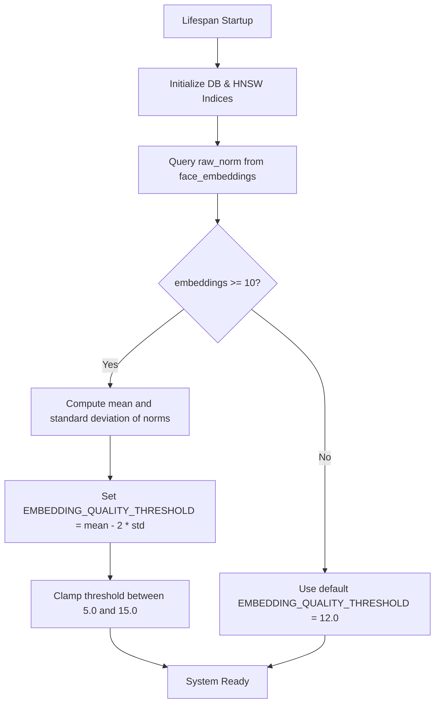
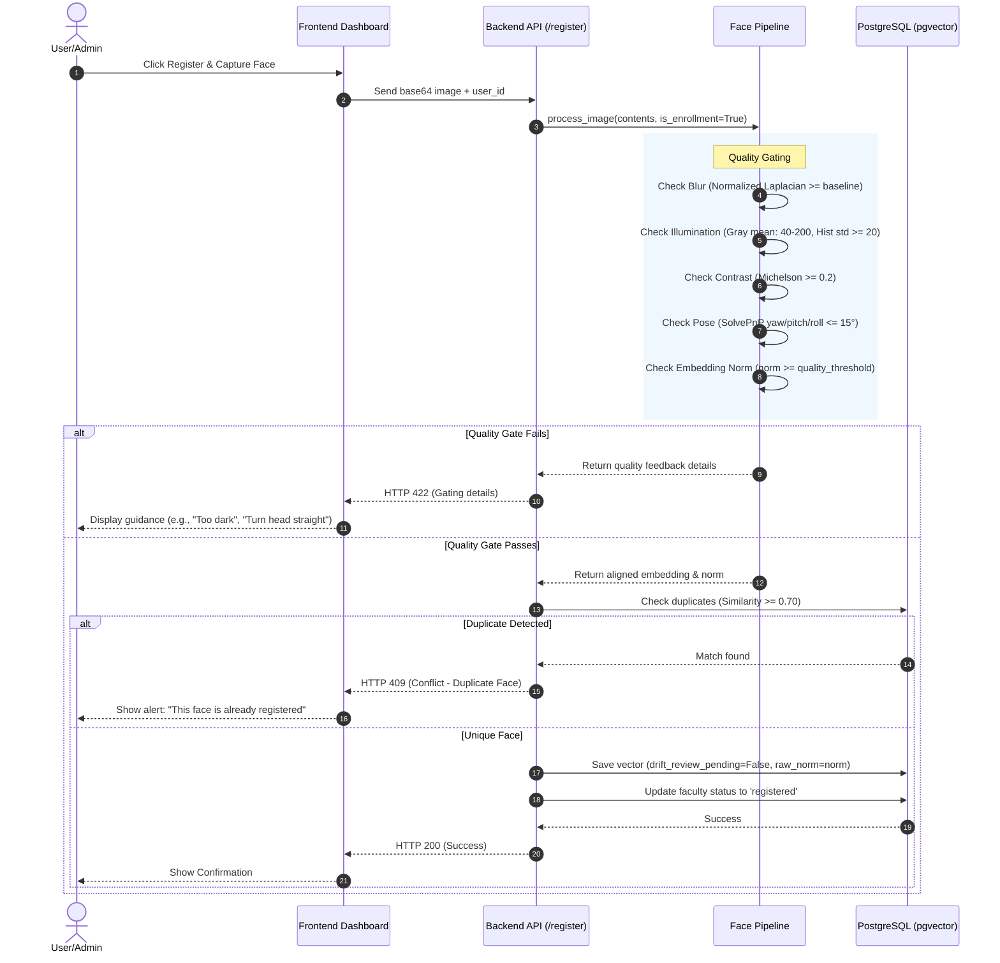
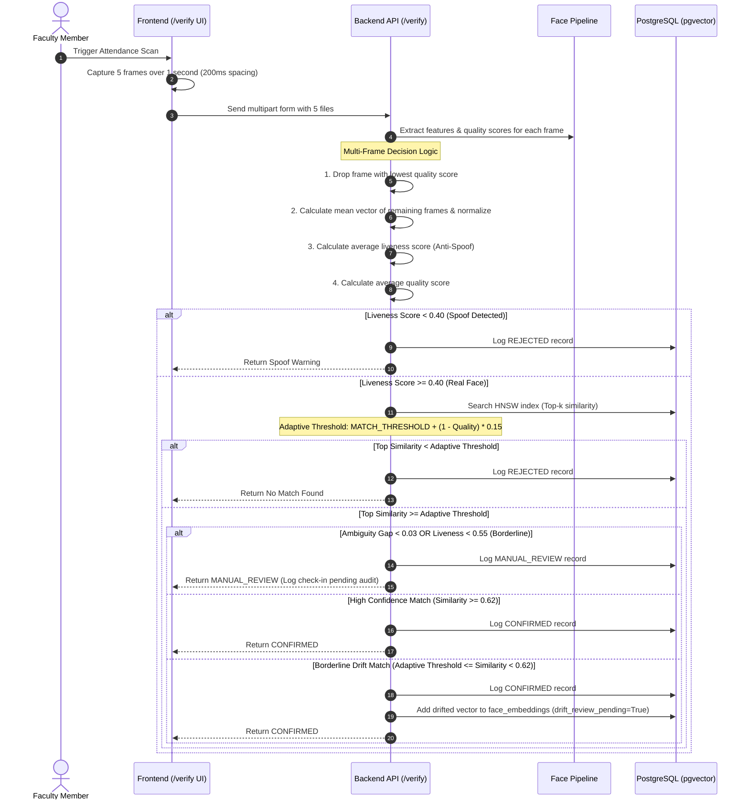

# Hypersphere Biometric Engine - Current Flow Architecture

This document outlines the current end-to-end flow of the Hypersphere Biometric Engine following the security hardening and quality-assurance refactoring.

---

## 1. System Initialization & Calibration

When the FastAPI backend starts up, it calibrates the system quality baseline:



> [!NOTE]
> Clamping the calibrated threshold between 5.0 and 15.0 prevents mathematical outliers from compromising overall biometric security.

---

## 2. Enrollment / Self-Registration Flow

Enrollment enforces **high-strictness quality gates** to ensure optimal database template vectors.



---

## 3. Verification & Multi-Frame Averaging Flow

Verification happens in daily attendance marking and testing. It features **multi-frame sampling** and **quality-adaptive matching thresholds**.



---

## 4. Biometric Drift Review Flow

Embedding drift is self-corrected over time via administrator supervision:

```mermaid
graph TD
    Trigger[Borderline Match: Threshold <= Similarity < 0.62] --> SavePending[Save drift candidate to DB: drift_review_pending = True]
    SavePending --> AdminPanel[Admin navigates to Drift Reviews tab]
    AdminPanel --> LoadDrifts[Fetch /api/v1/admin/drift-requests]
    
    AdminPanel -- Approve --> ApproveAPI[Post /api/v1/admin/drift-requests/{id}/approve]
    ApproveAPI --> ApproveAction[Set drift_review_pending = False, adding it to the user's active vectors]
    
    AdminPanel -- Reject --> RejectAPI[Post /api/v1/admin/drift-requests/{id}/reject]
    RejectAPI --> RejectAction[Delete drift request record from face_embeddings]
```

> [!TIP]
> The database retains a maximum of **15 embeddings** per user. If an approved drift causes the number of embeddings to exceed 15, the oldest verified embedding is automatically retired.
