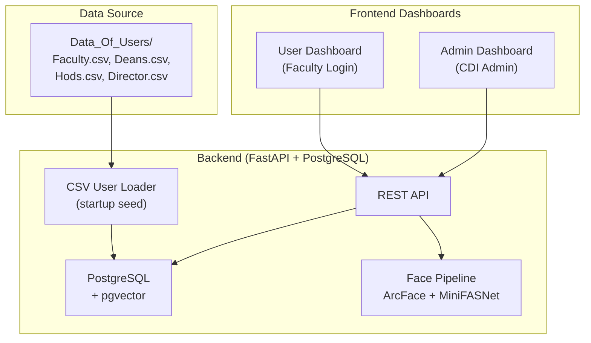
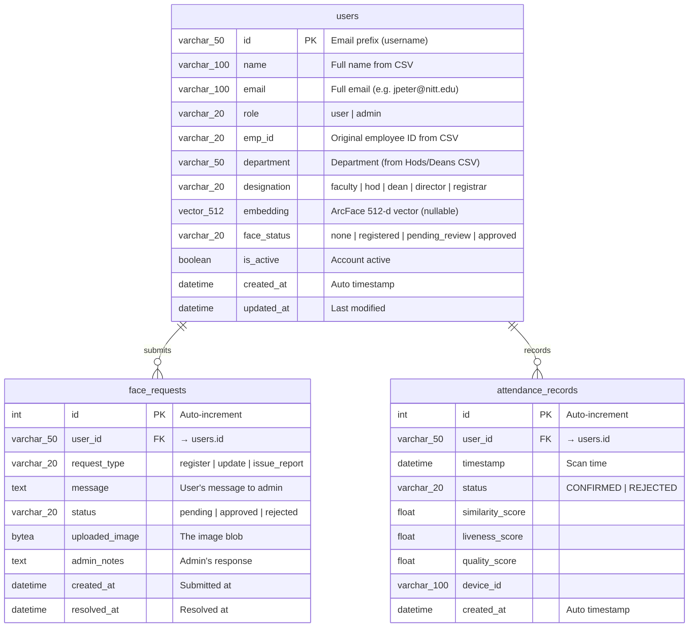
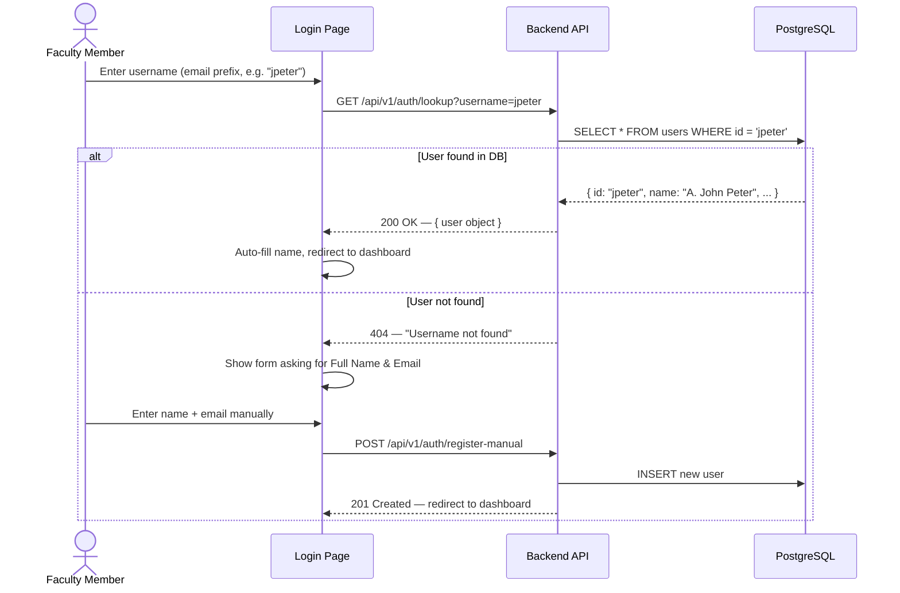
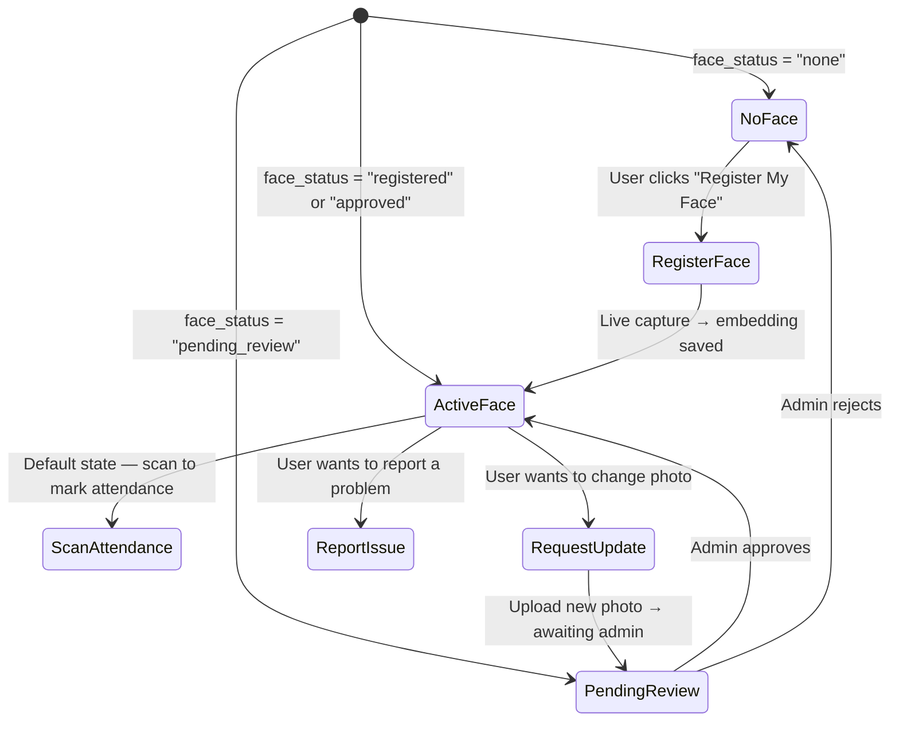
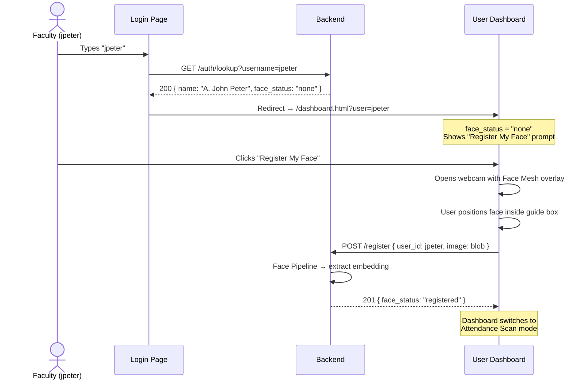
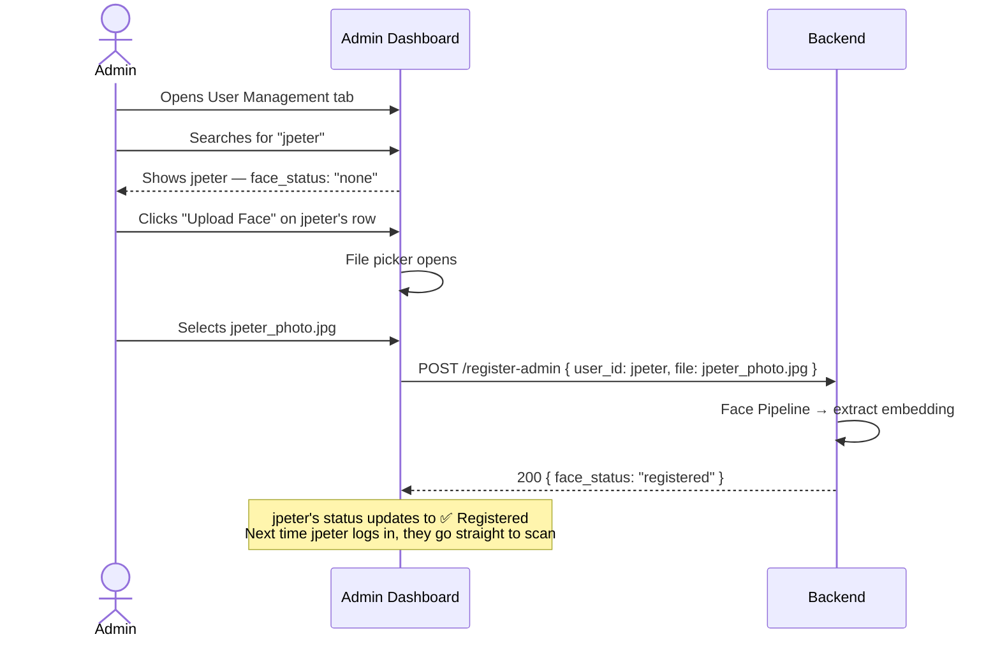
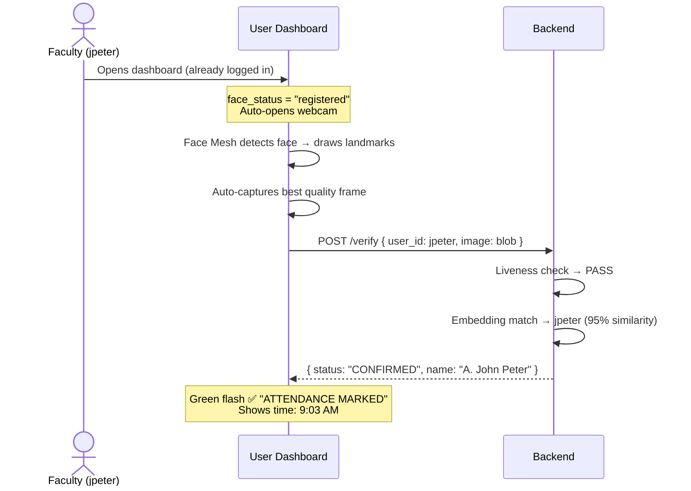
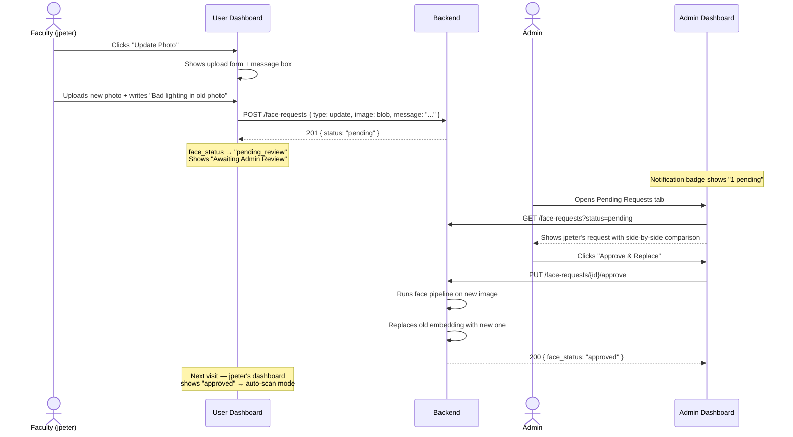
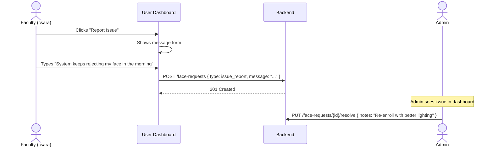

# Hypersphere Engine — Complete Workflow Plan

> Faculty Biometric Attendance System for NIT Tiruchirappalli

---

## 1. System Overview



### Core Idea

| Concept | Description |
|---------|-------------|
| **Identity Source** | `Data_Of_Users/*.csv` — ~730 NITT employees with `emp_email`, `emp_name`, `emp_id` |
| **Username = Email prefix** | `jpeter@nitt.edu` → username is **`jpeter`** — this is the login/registration ID |
| **Two Dashboards** | **User** (faculty member) and **Admin** (CDI staff) |
| **Face = Attendance** | Users scan their face on their dashboard to mark attendance; no buttons, just scan |

---

## 2. Data Model (Existing → Extended)

### 2.1 Current `faculty` Table

| Column | Type | Description |
|--------|------|-------------|
| `id` | `VARCHAR(50)` PK | Username (email prefix, e.g. `jpeter`) |
| `name` | `VARCHAR(100)` | Full name |
| `embedding` | `Vector(512)` | ArcFace embedding |
| `created_at` | `DATETIME` | Registration timestamp |
| `is_active` | `BOOLEAN` | Active flag |

### 2.2 Proposed Schema Changes



> [!IMPORTANT]
> The `face_status` field on `users` drives the entire UI flow:
> - `none` → User has no face registered → Show "Register Face" prompt
> - `registered` → Admin uploaded image OR user self-registered → Face is active
> - `pending_review` → User uploaded a new image → Awaiting admin approval
> - `approved` → Admin approved user's uploaded image → Face is active

---

## 3. CSV Seeding Logic

On backend startup (or via admin command), the system loads all CSV files and upserts users:

```
Data_Of_Users/
├── Faculty.csv           → 702 users, designation="faculty"
├── Hods.csv              → 20 users,  designation="hod"
├── Deans.csv             → 6 users,   designation="dean"
└── Director and Registrar.csv → 2 users, designation="director"/"registrar"
```

### Mapping Rules

| CSV Column | DB Column | Transform |
|------------|-----------|-----------|
| `emp_email` / `Email` | `id` | Extract prefix before `@` (e.g. `jpeter@nitt.edu` → `jpeter`) |
| `emp_email` / `Email` | `email` | Store full email |
| `emp_name` / `Name` | `name` | Direct map |
| `emp_id` | `emp_id` | Direct map (Faculty.csv only) |
| — | `role` | Default `"user"` (admins set manually) |
| — | `face_status` | Default `"none"` |
| — | `embedding` | `NULL` (no face yet) |

> [!NOTE]
> If a username already exists in DB, **do not overwrite** — only insert new records. This prevents destroying existing embeddings on restart.

---

## 4. Authentication Flow (Simplified)

Since this is an internal NITT system, authentication is kept lightweight:



> [!TIP]
> No passwords needed for the PoC phase. The username alone acts as the session identifier. For production, integrate NITT's institutional SSO/LDAP.

---

## 5. User Dashboard Flow

### 5.1 Dashboard States

The user dashboard adapts based on `face_status`:



### 5.2 User Dashboard — Page Layout

```
┌─────────────────────────────────────────────────────────┐
│  HYPERSPHERE · Welcome, Dr. A. John Peter (jpeter)  [⚙] │
├──────────────────────┬──────────────────────────────────┤
│                      │                                  │
│   [Profile Card]     │   [Live Camera Feed]             │
│   ┌──────────────┐   │   ┌──────────────────────────┐   │
│   │  Avatar/      │   │   │                          │   │
│   │  Initials     │   │   │   Webcam with Face Mesh  │   │
│   │               │   │   │   landmarks + bbox       │   │
│   │  Name         │   │   │                          │   │
│   │  Department   │   │   │                          │   │
│   │  Email        │   │   └──────────────────────────┘   │
│   └──────────────┘   │                                  │
│                      │   IF face_status == "none":       │
│   [Status Card]      │     → "Register My Face" button   │
│   ┌──────────────┐   │     → Live capture + save         │
│   │  Face Status: │   │                                  │
│   │  ● Registered │   │   IF face_status == "registered":│
│   │               │   │     → Auto-scan on page load     │
│   │  Last Scan:   │   │     → Green "PRESENT" flash      │
│   │  Today 9:03am │   │     → Attendance logged          │
│   └──────────────┘   │                                  │
│                      │   IF face_status == "pending":    │
│   [Actions Card]     │     → "Awaiting Admin Review"     │
│   ┌──────────────┐   │     → Camera disabled             │
│   │ 📷 Update     │   │                                  │
│   │    Photo      │   │   [Attendance History Table]      │
│   │ ⚠️ Report     │   │   ┌──────────────────────────┐   │
│   │    Issue      │   │   │  Date   Time   Status    │   │
│   └──────────────┘   │   │  Jun 27  9:03   ✅        │   │
│                      │   │  Jun 26  9:15   ✅        │   │
│                      │   │  Jun 25  —      ❌        │   │
│                      │   └──────────────────────────┘   │
└──────────────────────┴──────────────────────────────────┘
```

### 5.3 Core User Actions

| Action | Trigger | What Happens |
|--------|---------|--------------|
| **Register Face** | Click button (only if `face_status=none`) | Opens webcam → Live capture → Sends to `/api/v1/register` → Saves embedding → `face_status='registered'` |
| **Mark Attendance** | Auto on page load (if `face_status=registered/approved`) | Webcam opens → Face mesh tracking → Auto-captures best frame → Sends to `/api/v1/verify` → Logs attendance |
| **Update Photo** | Click "Update Photo" button | Opens form with message field + file upload → Sends to `/api/v1/face-requests` → `face_status='pending_review'` |
| **Report Issue** | Click "Report Issue" button | Opens text form → Sends message to `/api/v1/face-requests` with `type=issue_report` |

---

## 6. Admin Dashboard Flow

### 6.1 Admin Dashboard — Page Layout

```
┌─────────────────────────────────────────────────────────────────┐
│  HYPERSPHERE ADMIN · CDI Control Panel                      [⚙] │
├───────┬─────────────────────────────────────────────────────────┤
│       │                                                         │
│ NAV   │   [Tab: User Management]                                │
│       │   ┌─────────────────────────────────────────────────┐   │
│ 👤    │   │  Search: [_______________]  Filter: [All ▼]     │   │
│ Users │   │                                                 │   │
│       │   │  ┌────────┬──────────┬────────┬───────┬──────┐  │   │
│ 📋    │   │  │ User   │ Name     │ Status │ Dept  │ Act. │  │   │
│ Requests│  │  │ jpeter │ A. John  │ ●None  │ Mech  │ [+]  │  │   │
│       │   │  │ csara  │ C. Sara  │ ✅Reg  │ ECE   │ [👁] │  │   │
│ 📊    │   │  │ pjega  │ P. Jega  │ ⏳Pend │ CSE   │ [✓✗]│  │   │
│ Attend│   │  └────────┴──────────┴────────┴───────┴──────┘  │   │
│       │   └─────────────────────────────────────────────────┘   │
│ ⚙️    │                                                         │
│ Config│   [Tab: Pending Requests]                               │
│       │   ┌─────────────────────────────────────────────────┐   │
│       │   │  jpeter requested photo update (2 hours ago)    │   │
│       │   │  ┌──────────────────────────────────────────┐   │   │
│       │   │  │  [Current Photo]  →  [Uploaded Photo]    │   │   │
│       │   │  │                                          │   │   │
│       │   │  │  Message: "Lighting was bad in my old    │   │   │
│       │   │  │  photo, uploading a better one"          │   │   │
│       │   │  │                                          │   │   │
│       │   │  │  [✅ APPROVE & REPLACE]  [❌ REJECT]     │   │   │
│       │   │  └──────────────────────────────────────────┘   │   │
│       │   └─────────────────────────────────────────────────┘   │
│       │                                                         │
│       │   [Tab: Attendance Reports]                             │
│       │   ┌─────────────────────────────────────────────────┐   │
│       │   │  Date: [Jun 27, 2026 ▼]                         │   │
│       │   │  Present: 487/702  │  Absent: 215/702           │   │
│       │   │  ┌──────┬────────┬───────┬──────────────────┐   │   │
│       │   │  │ User │ Name   │ Time  │ Status           │   │   │
│       │   │  │ ...  │ ...    │ ...   │ ...              │   │   │
│       │   │  └──────┴────────┴───────┴──────────────────┘   │   │
│       │   └─────────────────────────────────────────────────┘   │
└───────┴─────────────────────────────────────────────────────────┘
```

### 6.2 Core Admin Actions

| Action | Description |
|--------|-------------|
| **View All Users** | Paginated table of all 730+ users with face status, search, and filters |
| **Upload Face for User** | Admin selects a user → uploads their photo → runs face pipeline → saves embedding → sets `face_status='registered'` |
| **Review Pending Requests** | See user-submitted photo updates → Compare old vs new → Approve (replaces embedding) or Reject |
| **View Issue Reports** | Read user complaints about recognition failures → respond with notes |
| **Attendance Reports** | Date-based attendance view with present/absent counts and export |
| **Manage Admins** | Promote/demote users to admin role |

---

## 7. Complete API Endpoints Plan

### 7.1 Auth Endpoints

| Method | Endpoint | Description |
|--------|----------|-------------|
| `GET` | `/api/v1/auth/lookup?username={id}` | Look up user by username, auto-fetch name from DB/CSV |
| `POST` | `/api/v1/auth/register-manual` | Register a user not found in CSV (requires name + email) |

### 7.2 User Endpoints (Existing + New)

| Method | Endpoint | Description |
|--------|----------|-------------|
| `GET` | `/api/v1/users` | List all users (admin only) |
| `GET` | `/api/v1/users/{id}` | Get user profile |
| `PUT` | `/api/v1/users/{id}` | Update user profile |
| `DELETE` | `/api/v1/users/{id}` | Delete user (admin only) |

### 7.3 Face Registration & Verification

| Method | Endpoint | Description |
|--------|----------|-------------|
| `POST` | `/api/v1/register` | Register face via live capture (user self-register) |
| `POST` | `/api/v1/register-admin` | Admin uploads a photo for a specific user |
| `POST` | `/api/v1/verify` | Scan face → match → log attendance |

### 7.4 Face Request Endpoints (New)

| Method | Endpoint | Description |
|--------|----------|-------------|
| `POST` | `/api/v1/face-requests` | User submits a photo update or issue report |
| `GET` | `/api/v1/face-requests` | List all requests (admin) or user's own requests |
| `GET` | `/api/v1/face-requests/{id}` | Get single request details + image |
| `PUT` | `/api/v1/face-requests/{id}/approve` | Admin approves → replaces old embedding |
| `PUT` | `/api/v1/face-requests/{id}/reject` | Admin rejects → keeps old embedding |

### 7.5 Attendance Endpoints

| Method | Endpoint | Description |
|--------|----------|-------------|
| `GET` | `/api/v1/attendance?user_id={id}` | Get attendance history for a user |
| `GET` | `/api/v1/attendance/report?date={date}` | Admin: daily attendance summary |

### 7.6 CSV Data Endpoint

| Method | Endpoint | Description |
|--------|----------|-------------|
| `POST` | `/api/v1/admin/seed-csv` | Trigger CSV import (admin only) |

---

## 8. Frontend Pages

| Page | Route | Audience | Description |
|------|-------|----------|-------------|
| Login | `/login.html` | All | Enter username → auto-lookup → redirect |
| User Dashboard | `/dashboard.html` | Faculty | Face scan, attendance, profile, requests |
| Admin Dashboard | `/admin.html` | Admin | User management, request review, reports |
| Registry (existing) | `/registry.html` | Admin | Full profile grid (already built) |

---

## 9. End-to-End User Journeys

### Journey 1: First-Time Faculty Registration (Self)



### Journey 2: Admin Bulk-Registers a Faculty Member



### Journey 3: Daily Attendance Scan



### Journey 4: User Requests Photo Update



### Journey 5: User Reports an Issue



---

## 10. Implementation Phases

### Phase 1 — Database & CSV Seeding *(Backend)*
- [x] Extend `users` table schema (add `email`, `role`, `designation`, `department`, `face_status`)
- [x] Create `face_requests` table
- [x] Build CSV loader that parses all 4 CSV files and upserts into `users`
- [x] Add `/api/v1/auth/lookup` endpoint
- [x] Add `/api/v1/admin/seed-csv` endpoint
- [x] Migrate existing `faculty` data to new `users` schema

### Phase 2 — Login Page *(Frontend)*
- [x] Build `/login.html` with username input
- [x] Auto-lookup on input → show name + redirect
- [x] Handle "not found" → manual registration form
- [x] Store session in `localStorage` (user ID + role)

### Phase 3 — User Dashboard *(Frontend)*
- [x] Build `/dashboard.html` with adaptive layout based on `face_status`
- [x] Profile card (name, dept, email, status)
- [x] Face registration flow (webcam → capture → register)
- [x] Attendance scan flow (auto-capture → verify → log)
- [x] Attendance history table
- [x] Photo update request form
- [x] Issue report form

### Phase 4 — Admin Dashboard *(Frontend + Backend)*
- [x] Build `/admin.html` with tabbed interface
- [x] User Management tab (search, filter, upload face for user)
- [x] Pending Requests tab (approve/reject with side-by-side comparison)
- [x] Attendance Reports tab (date picker, present/absent counts)
- [x] Add `/api/v1/register-admin`, `/api/v1/face-requests/*` endpoints

### Phase 5 — Polish & Production
- [ ] Add role-based access control middleware
- [ ] Add email notifications for request status changes
- [ ] Add attendance export (CSV download)
- [ ] Performance optimization for 700+ users
- [ ] Mobile-responsive layouts

---

## 11. File Structure (Proposed)

```
frontend/
├── index.html          → Redirect to login
├── login.html          → Username entry page
├── dashboard.html      → User dashboard (attendance + profile)
├── admin.html          → Admin dashboard (management + reports)
├── registry.html       → Full user registry grid (existing)
├── style.css           → Shared design system
├── login.js            → Login page logic
├── dashboard.js        → User dashboard logic
├── admin.js            → Admin dashboard logic
└── main.js             → Legacy (original demo page, keep for reference)

backend/app/
├── main.py             → FastAPI app
├── config.py           → Settings
├── api/
│   ├── endpoints.py    → Existing endpoints (register, verify, faculty)
│   ├── auth.py         → NEW: Login lookup + manual registration
│   ├── face_requests.py → NEW: User requests + admin review
│   └── attendance.py   → NEW: Attendance reports
├── core/
│   ├── pipeline.py     → Face processing pipeline
│   └── csv_loader.py   → NEW: CSV parsing + DB seeding
├── db/
│   ├── database.py     → Schema definitions (extended)
│   └── vector_index.py → pgvector operations
└── models/
    └── schemas.py      → Pydantic models (extended)
```

---

> [!CAUTION]
> This plan assumes no institutional SSO/LDAP integration for now. The username-only auth is suitable for the PoC/hackathon phase. For production deployment at NITT, integrate with the institutional identity provider.
