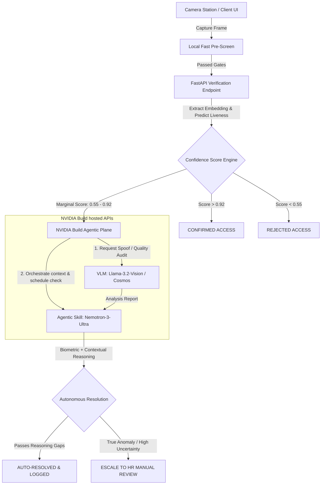
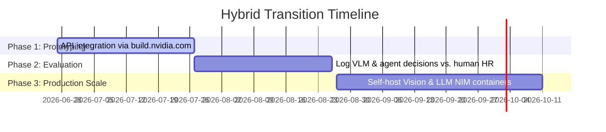

# NVIDIA Build (NIM/Agentic Skills) Integration Strategy
## Enhancing the Hypersphere Biometric Engine

This document provides a strategic blueprint for integrating the free APIs, models, and agentic skills available on [build.nvidia.com](https://build.nvidia.com) into the **Hypersphere Engine**. By mapping the capabilities of hosted NVIDIA Inference Microservices (NIMs) to the theoretical challenges outlined in `facial_attendance_architecture.md`, we can transition from a rigid local pipeline to a highly resilient, self-healing, and context-aware biometric system.

---

## 1. Pipeline Capability Mapping

The current system relies on a lightweight, static pipeline (MediaPipe + ONNX ArcFace + PyTorch MiniFASNetV2) that operates deterministically but lacks adaptive intelligence. Integrating NVIDIA Build hosted APIs provides key advancements at critical pipeline stages:

| Architecture Phase | Current Implementation | NVIDIA Build Enhancement | Model / Skill API |
| :--- | :--- | :--- | :--- |
| **Phase 6: Quality Assessment** | Laplacian Variance (scalar blur metric) | **Active Quality Feedback:** Multimodal analysis of crop to explain quality issues to users in real time. | `meta/llama-3.2-11b-vision-instruct` <br> `nvidia/nemotron-nano-12b-v2-vl` |
| **Phase 8: Anti-Spoofing** | MiniFASNetV2 crop probability (Level 1 print/screen detection) | **Level 2-4 Spoof Auditing:** Contextual scene inspection for screen borders, paper edges, reflections, and deepfake warping. | `nvidia/cosmos-3-nano-reasoner` <br> `meta/llama-3.2-90b-vision-instruct` |
| **Phase 9: Server Deployment** | Local ONNX / PyTorch execution on CPU/GPU | **NIM Containers:** Optimized model serving via Triton, TensorRT, and Milvus NIM for high-throughput scaling. | `NVIDIA NIM self-hosted containers` |
| **Phase 13: Decision Engine** | Simple threshold binary checks | **Agentic Manual Review:** Reasoning agent coordinates timetables, WiFi logs, and VLM analysis to resolve marginal cases. | `nvidia/nemotron-3-ultra-550b-a55b` <br> `deepseek-ai/deepseek-v4-pro` |

---

## 2. Core Integration Architecture



---

## 3. High-Impact Integration Areas

### A. Level 2-4 Presentation Attack Auditing (Phase 8: Anti-Spoofing)
While MiniFASNetV2 is excellent for low-latency Level 1 print/screen detection, it cannot detect high-fidelity silicone masks, professional displays, or deepfakes. When a verification score falls in an ambiguous zone, the raw frame can be dispatched asynchronously to the **NVIDIA Cosmos 3 Reasoner** or **Llama 3.2 90B Vision Instruct** endpoint.

*   **Prompting Paradigm:** 
    > *"Analyze this face capture frame for presentation attack signatures. Look closely for physical screen borders, moiré pixel patterns, paper warping, cut-out eyes, or skin-texture inconsistencies indicating a mask or deepfake warp. Provide a step-by-step reasoning chain and output a structured liveness assessment."*
*   **Outcome:** Protects the system against sophisticated digital/physical injection attacks without burdening local compute resources.

### B. Biometric Quality Feedback & Edge Guidance (Phase 6: Quality)
Scalar quality gates (like Laplacian variance) tell a user *that* their image is bad, but not *why* or *how to fix it*. We can integrate **Nemotron-Nano-12B-v2-VL** to generate direct, user-friendly instructions.

*   **Feedback Generation:** If quality is below the enrollment threshold (0.35), the VLM inspects the frame and returns actionable feedback:
    *   *"Too much backlighting; please step away from the window."*
    *   *"The camera lens is dirty or out of focus. Please wipe the lens and try again."*
    *   *"Your face is partially turned. Look directly at the camera with a neutral expression."*

### C. Agentic Resolution of Marginal Matches (Phase 13: Decision Engine)
In `facial_attendance_architecture.md`, the "manual review queue" is a major operational bottleneck. An **Agentic Skill** utilizing a reasoning model (like Nemotron-3-Ultra) can act as an autonomous agent to clear marginal matches by corroborating context:

```
[Agent Reasoner Input]
1. Biometric Match Score: 0.72 (Marginal, threshold is 0.85)
2. VLM Audit Report: "High quality image. Target wearing newly added glasses; otherwise matches."
3. Device GPS: [10.7725, 79.1378] (Inside Dept. Office)
4. Timetable check: Dr. Keerthi has a lecture starting in 5 minutes.
5. IP Scan: Dr. Keerthi's phone authenticated on campus WiFi 3 minutes ago.

[Agent Decision]
Action: AUTO-CONFIRMED. Reason: Temporal and spatial coordinates strongly match roster schedule. 
        Biometric margin degradation explained by visual variation (glasses). Update template.
```

---

## 4. Integration Protocol: Python Implementation

Since NVIDIA Build endpoints are compatible with the OpenAI API protocol, integrating them into the FastAPI backend requires zero heavy SDK installations. 

Below is a proposed implementation helper for `backend/app/core/nvidia_client.py` to audit verification frames:

```python
import base64
import logging
from openai import AsyncOpenAI
from app.config import settings

logger = logging.getLogger(__name__)

# Initialize client pointing to NVIDIA Build API Gateway
# (Requires setting NVIDIA_API_KEY in environment)
nv_client = AsyncOpenAI(
    base_url="https://integrate.api.nvidia.com/v1",
    api_key=settings.NVIDIA_API_KEY if hasattr(settings, "NVIDIA_API_KEY") else "nvapi-mock"
)

async def audit_presentation_attack(image_bytes: bytes) -> dict:
    """
    Asynchronously dispatches a verification capture frame to NVIDIA's Cosmos 3 Reasoner
    to detect liveness anomalies, deepfakes, or spoofing artifacts.
    """
    if settings.NVIDIA_API_KEY == "nvapi-mock" or not settings.NVIDIA_API_KEY:
        logger.warning("NVIDIA API key not set. Skipping VLM audit.")
        return {"liveness_verified": True, "reasoning": "Mock mode active."}

    try:
        base64_image = base64.b64encode(image_bytes).decode("utf-8")
        
        response = await nv_client.chat.completions.create(
            model="nvidia/cosmos-3-nano-reasoner",
            messages=[
                {
                    "role": "user",
                    "content": [
                        {
                            "type": "text", 
                            "text": (
                                "Inspect this face image for biometric security issues. "
                                "Identify if this is a live presentation of a real person, "
                                "or if it exhibits anomalies like screen reflections, "
                                "glare from a printed photo, borders of an iPad display, "
                                "or mask boundaries. Answer with structured JSON: "
                                '{"is_spoof": boolean, "confidence": float, "reasoning": "string"}'
                            )
                        },
                        {
                            "type": "image_url",
                            "image_url": {
                                "url": f"data:image/jpeg;base64,{base64_image}"
                            }
                        }
                    ]
                }
            ],
            response_format={"type": "json_object"},
            max_tokens=150,
            temperature=0.2
        )
        
        # Parse JSON output from model
        import json
        result = json.loads(response.choices[0].message.content)
        return result
        
    except Exception as e:
        logger.error(f"NVIDIA hosted VLM audit failed: {e}")
        return {"is_spoof": False, "confidence": 0.0, "reasoning": f"Audit failed: {str(e)}"}
```

---

## 5. Architectural Trade-offs & Hybrid Transition Plan

Using NVIDIA Build APIs brings outstanding capabilities, but we must account for production constraints:



### 1. Latency vs. Rich Analysis
*   **Local Pipeline (~30-50ms):** Must remain the primary gate for standard, high-confidence verifications to guarantee instant, sub-second user response times.
*   **Hosted APIs (~500ms - 1500ms):** Must run **asynchronously** or be reserved for the **marginal audit path** (when local scores fall within the uncertain `[0.55, 0.85]` interval).

### 2. Privacy & Data Residency
*   **Prototyping (build.nvidia.com):** Data is transmitted via secure HTTPS endpoints. Standard enterprise terms state that data sent to NVIDIA hosted APIs is not persisted or used for model training, matching high privacy requirements.
*   **Production Scale (NVIDIA NIM Containers):** To strictly enforce zero external data transmission (biometric isolation), the system can download the **NIM container images** (e.g., Llama-3.2-Vision NIM, Triton NIM) and host them locally within the university's private VPC, running directly on local GPUs.

---
> [!TIP]
> **Next Steps:** To activate this functionality, register for a developer account on **build.nvidia.com**, retrieve a free API token, and set it as `NVIDIA_API_KEY` in the environment configuration of the FastAPI service.
