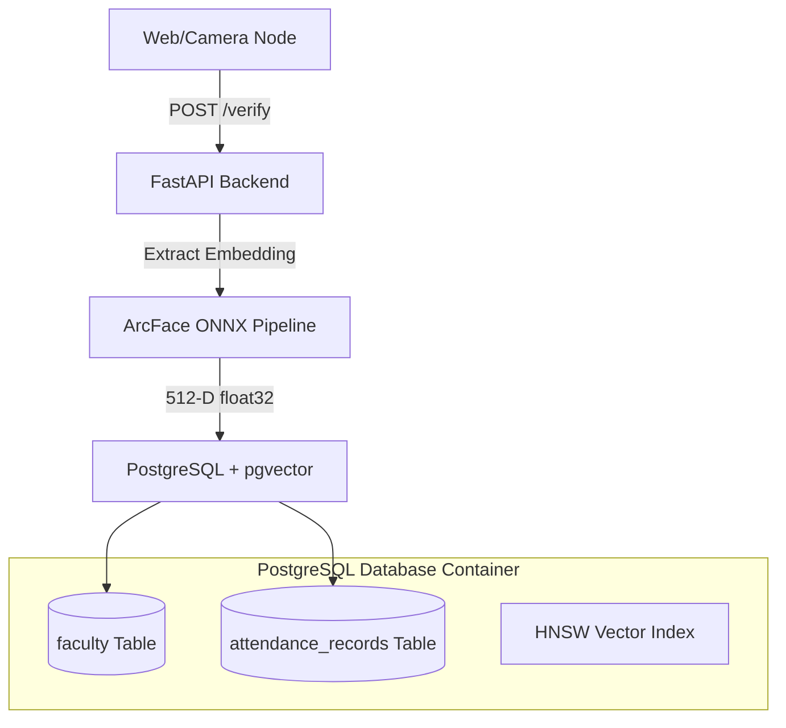

# Implementation Plan: PostgreSQL + pgvector Migration

This document outlines the architecture, setup steps, and code refactoring required to migrate the backend vector search from **SQLite + FAISS** to **PostgreSQL + pgvector**.


---

## 1. Architectural Blueprint



### Key Differences:
*   **Unified Storage:** The `faculty` table contains both metadata and the 512-D embedding column.
*   **ACID Compliance:** Transactions for adding/removing users and their templates are fully atomic.
*   **HNSW Indexing:** Leverages PG's native index structures for scalable similarity matching.

---

## 2. Infrastructure Setup (Docker)

To run PostgreSQL with `pgvector` locally, we spin up a Docker container using the official pgvector image.

### `docker-compose.yml` (To be added in root)
```yaml
version: '3.8'

services:
  postgres:
    image: pgvector/pgvector:16-pg16
    container_name: hypersphere_postgres
    ports:
      - "5432:5432"
    environment:
      POSTGRES_USER: postgres
      POSTGRES_PASSWORD: password
      POSTGRES_DB: face_attendance
    volumes:
      - postgres_data:/var/lib/postgresql/data
    healthcheck:
      test: ["CMD-SHELL", "pg_isready -U postgres"]
      interval: 5s
      timeout: 5s
      retries: 5

volumes:
  postgres_data:
```

---

## 3. Dependency Updates

We must add psycopg/asyncpg support and pgvector client libraries:
*   `pgvector` (Python wrapper for pgvector)
*   `asyncpg` (Asynchronous driver for PostgreSQL)
*   `psycopg2-binary` (Synchronous driver for migrations/initialization)

---

## 4. Code Refactoring Strategy

### A. Database Schema (`backend/app/db/database.py`)
Modify the `faculty` table schema to include the `Vector` column:
```python
from pgvector.sqlalchemy import Vector

faculty = sqlalchemy.Table(
    "faculty",
    metadata,
    sqlalchemy.Column("id", sqlalchemy.String(50), primary_key=True),
    sqlalchemy.Column("name", sqlalchemy.String(100), nullable=False),
    sqlalchemy.Column("embedding", Vector(512), nullable=True),  # 512-D Vector
    sqlalchemy.Column("created_at", sqlalchemy.DateTime(), server_default=sqlalchemy.func.now()),
    sqlalchemy.Column("is_active", sqlalchemy.Boolean(), default=True),
)
```

### B. Vector Index Manager (`backend/app/db/vector_index.py`)
We refactor the manager to perform SQL transactions instead of interacting with FAISS files:

1.  **Add Vector:**
    ```python
    async def add_vector(self, faculty_id: str, embedding: np.ndarray):
        # Convert numpy array to list representation for pgvector
        emb_list = embedding.tolist()
        query = faculty.update().where(faculty.c.id == faculty_id).values(embedding=emb_list)
        await database.execute(query)
    ```

2.  **Cosine Similarity Search:**
    We compute similarity using the operator `<=>` (cosine distance) in pgvector:
    $$\text{Cosine Similarity} = 1 - \text{Cosine Distance}$$
    
    ```python
    async def search(self, query_embedding: np.ndarray, top_k=1):
        emb_list = query_embedding.tolist()
        # Cosine distance operator <=> in SQL
        # 1 - (embedding <=> query) gives similarity score
        raw_query = """
            SELECT id, name, (1 - (embedding <=> :query_val::vector)) AS similarity
            FROM faculty
            WHERE is_active = true AND embedding IS NOT NULL
            ORDER BY embedding <=> :query_val::vector
            LIMIT :limit
        """
        results = await database.fetch_all(
            query=raw_query, 
            values={"query_val": str(emb_list), "limit": top_k}
        )
        return [(r["id"], r["similarity"]) for r in results]
    ```

---

## 5. Pros & Cons Evaluation

*   **Pros:** Simpler code (removes ~100 lines of custom FAISS saving/loading mappings), absolute transaction safety, zero sync drift.
*   **Cons:** Requires running Docker desktop/Postgres service on the host machine.
