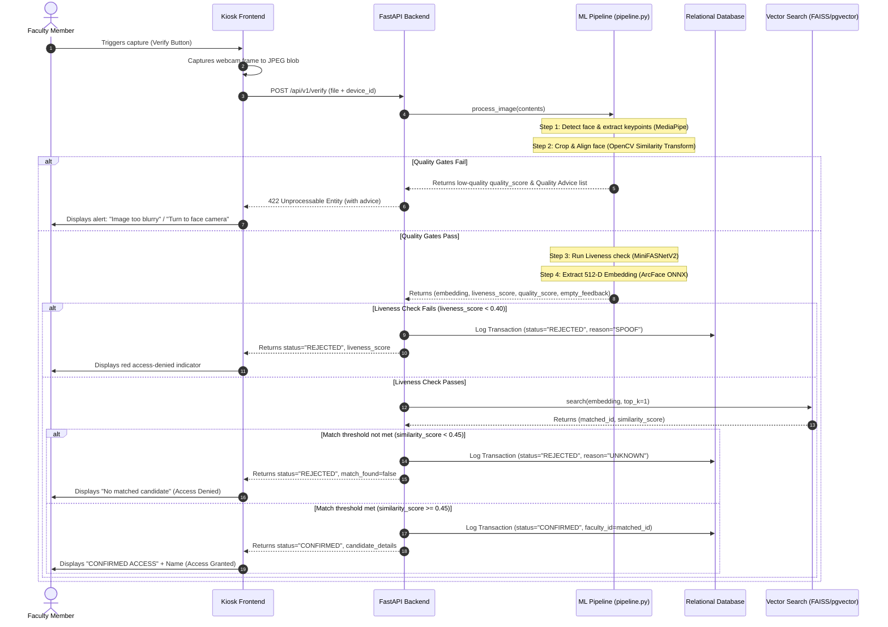
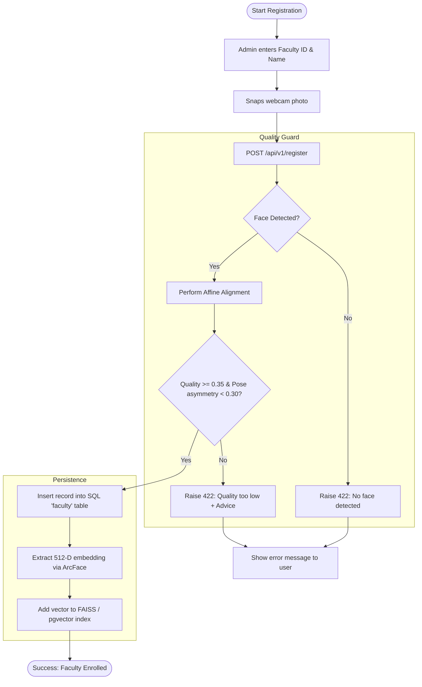

# System Workflow Plan: Face Registration & Verification

This document specifies the step-by-step operational workflows for enrolling new identities and verifying attendance transactions.

---

## 1. Verification (Attendance Check-in) Workflow

This workflow represents the low-latency path executed when a user attempts to verify their identity at a kiosk.

---

## 2. Registration (Enrollment) Workflow

This workflow represents the gateway path for adding a new faculty member's identity representation to the system.

