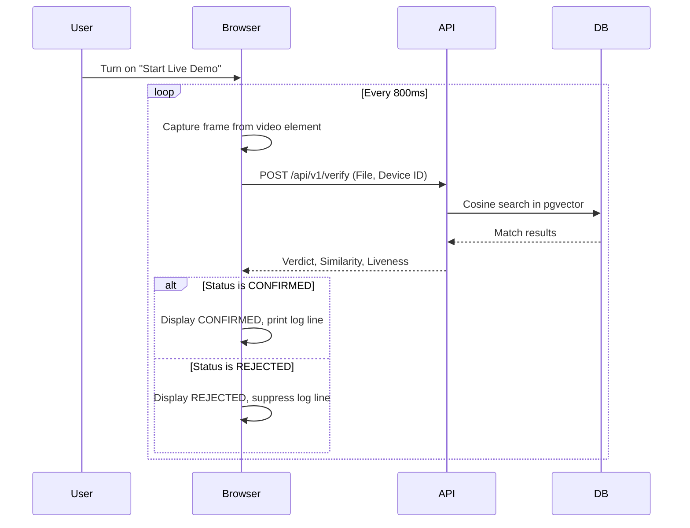

# Feature F-04: Real-time Kiosk Live Demo

## 📖 Overview
The dashboard features a continuous check-in/verification mode suited for walk-by kiosk authentication. This eliminates the need for users to manually press buttons to verify themselves.

---

## 🛠️ Implementation Details

### 1. Client-Side Polling Loop
*   **Method:** A JavaScript-driven loop (`runLiveDemoLoop()`) polls the backend by automatically grabbing and uploading the camera frame every `800ms`.
*   **Silent Flag:** The loop calls `verifyPresentation(silent = true)`.
*   **Spam Mitigation:**
    *   If no face is matched (spoof or no profile), it updates the verdict card visually but **suppresses** printing rejection notices to the terminal logs.
    *   If a face is successfully recognized, it logs a prominent green success log:
        `[15:10:45 PM] SUCCESS: Verified Keerthi (Sim: 86%, Live: 98%)`
*   **File Location:** `backend/app/main.py` -> `toggleLiveDemo()`, `runLiveDemoLoop()`

### 2. State Linkage & Safety
*   **Auto-Stop:** If the user stops the webcam feed, the live demo state automatically detects the shutdown and toggles off to prevent infinite error logging.
*   **Flash Effect:** Capture events apply a fast flash class (`capture-flash`) to the video wrapper, signaling the user that detection is active.

---

## ⚡ UX Flow Diagram

