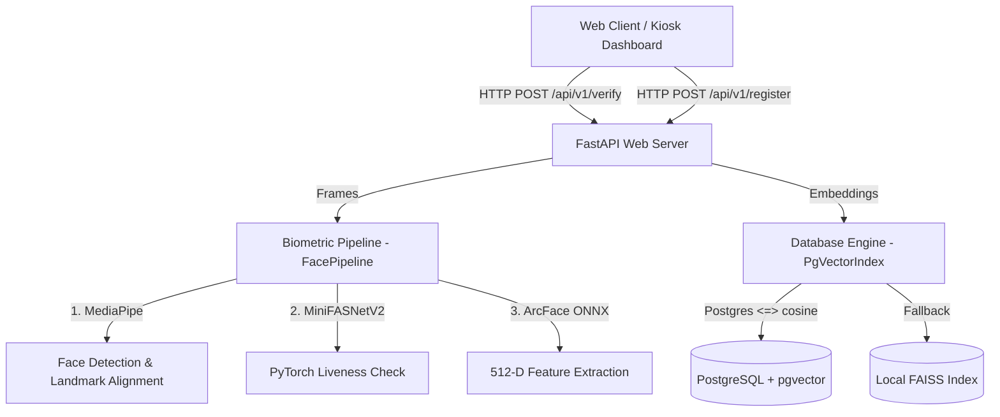

# Hypersphere Biometrics: Feature Registry & Developer Guide

Welcome! This directory serves as a self-documenting feature catalog and architectural blueprint for the **Hypersphere Face Attendance Engine**. It is designed specifically to help developers and AI agents (vibe coding assistants) quickly understand the system's capabilities, design decisions, and how to seamlessly extend it without introducing regressions.

---

## 🗺️ Architectural Topology

The application follows a decoupled client-server architecture:



---

## 📦 Active Feature Registry

| Feature ID | Feature Name | Description | Key Modules |
| :--- | :--- | :--- | :--- |
| `F-01` | **[Biometric Verification Pipeline](01_biometric_pipeline.md)** | Face detection, affine alignment, CNN-based liveness verification, and ArcFace feature extraction. | `backend/app/core/pipeline.py` |
| `F-02` | **[Vector Database & Storage](02_vector_database.md)** | Highly scalable async PostgreSQL storage using `pgvector` with a zero-dependency local `FAISS` index fallback. | `backend/app/db/` |
| `F-03` | **[Biometric Quality Gating](03_quality_gating.md)** | Pre-inference checks for illumination, face size, yaw angle, and blur to prevent bad enrollments/verifications. | `backend/app/core/pipeline.py` |
| `F-04` | **[Real-time Kiosk Live Demo](04_kiosk_live_demo.md)** | Client-side polling and silent backend verification for instant, automated check-ins. | `backend/app/main.py` |

---

## 🛠️ Vibe Coding Extension Guide (How to Add Features)

AI agents and developers should follow these checklists when modifying the codebase:

### 1. Adding a New API Endpoint
*   **File to edit:** `backend/app/api/endpoints.py`
*   **Rule:** Always write asynchronous endpoints (`async def`).
*   **Rule:** Inject the DB session using the `get_db` dependency.
*   **Template:**
    ```python
    @router.post("/new-feature")
    async def handle_new_feature(
        payload: NewSchema,
        db: AsyncSession = Depends(get_db)
    ):
        # Your logic here
        return {"status": "success"}
    ```

### 2. Modifying the ML Inference Pipeline
*   **File to edit:** `backend/app/core/pipeline.py`
*   **Rule:** If adding a model, add its download link to `scripts/download_models.py` and its configuration path to `backend/app/config.py`.
*   **Rule:** Ensure you handle the mock fallback gracefully so that the system remains bootable if the model is missing.
*   **Rule:** Return detailed diagnostic metrics (e.g., yaw, lighting, liveness score) in the pipeline response.

### 3. Modifying Database Schemas or Vector Operations
*   **Files to edit:** `backend/app/models/` and `backend/app/db/vector_index.py`
*   **Rule:** Always use standard SQL `CAST(embedding AS vector(512))` instead of PostgreSQL-specific `::vector` typecasts, as double-colons cause syntax issues during SQLAlchemy parameter binding.
*   **Rule:** When adding a new table, register it in `backend/app/db/database.py` inside `Base.metadata.create_all` so it auto-provisions on boot.

---

## ⚡ Core Architecture Constraints (Do Not Break!)

1. **Async Database Operations:** The application uses `asyncpg` for non-blocking I/O. Do not use synchronous SQLAlchemy calls or sessions.
2. **Privacy First:** Never write raw images to the database or storage disk. Only extract and save the 512-dimensional facial embeddings.
3. **Graceful Fallbacks:** If the PostgreSQL container goes offline, the `PgVectorIndex` must gracefully degrade to the local FAISS index file (`faiss_vectors.index`) to prevent system crashes.
